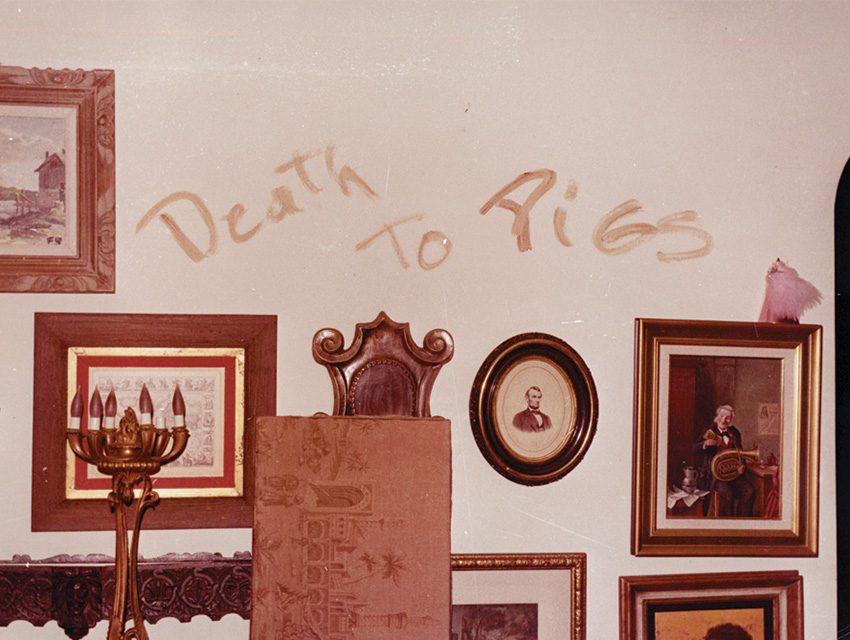

Charles Milles Manson was an American criminal born in Cincinnati, Ohio. Being the leader of the infamous cult 'The Manson Family', his name and reputation spread fear throughout America with his "family" committing a total of nine murders at four different locations between July-August of 1969. Later on, in his testimony he exclaimed:

> " My father is your system... I am only a reflection of you... Spent my life in the tombs you have built". 

The Title stays consistent with the article "THE" maintaining a level cap height, whereas the enlarged cap height of "Manson" is proliferated, this allows the book to easily distinguish its contents towards any readers who walk by or observe it whilst also combining the element of spotlighting as we can now easily understand who the work will be based about. From my understanding, combining this with the sans-serif layout of the entirety evokes conformity and collectivism, the heavy-weight of the title also conjures the image of a massive stamp slamming onto the book, my take on this is to provoke the absolutely grotesque crimes that led to his incarceration.

As unsettling as it is the blood of both home owners are used as a form of speech by the