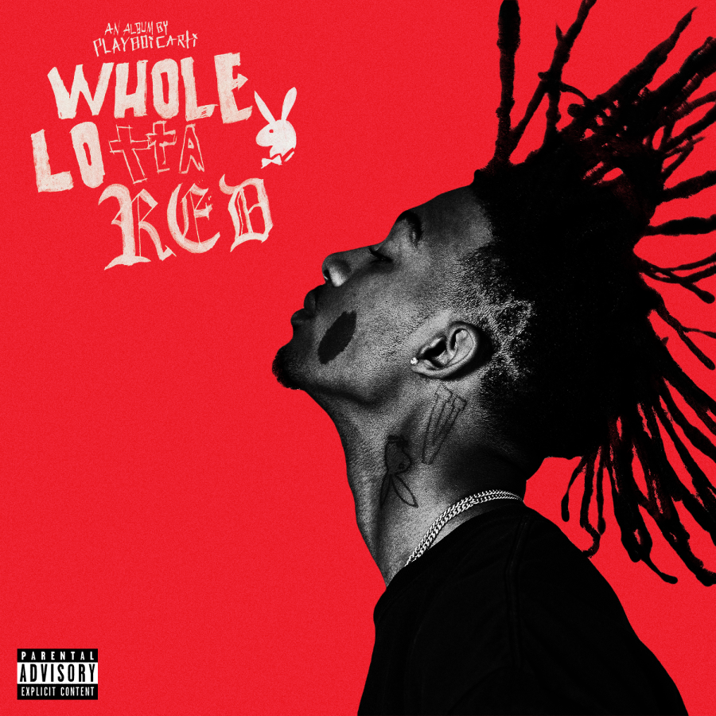
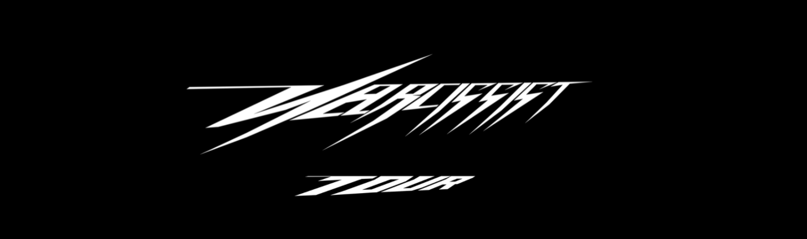
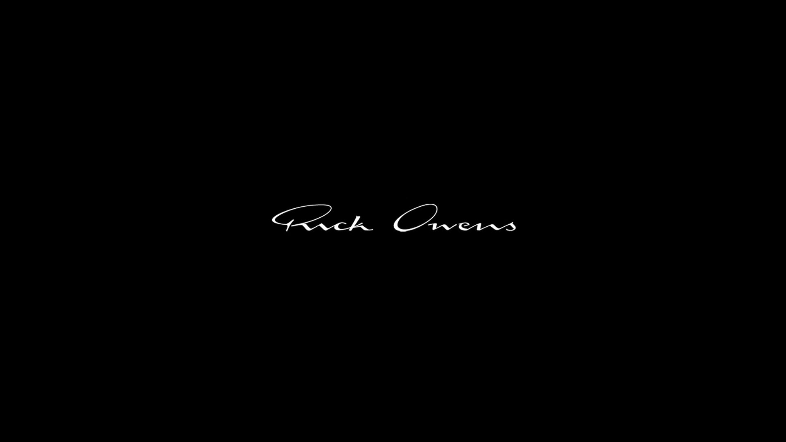

Jordan Terell Carter AKA. Playboi Carti, is an American rapper and singer-songwriter. With a huge fanbase that is global and often revered as an influential figure in the scene. He is known mostly through his experimental musical style, gothic fashion and an overall unique aesthetic. After beginning to gain mainstream attention in 2017 Carti ammased an almost ‘cult like following’, which will be our main focus whether it be through social media, books, brands you name it. 

Initially his current aesthetic is displayed through the varying typefaces used within the album cover such as the use of Fraktur, this level of difference could be his expression of individualism and his overall skillset, this being experimental and all over the place. The all capitalised lettering which sticks out and screams into your face further supports this as the varying cap heights and descenders makes it unpredictable to guess what he is going to do but still induces excitement. Additionally, the crossbar on the letter ‘H’ is akwardly low , this with what seems to be the creator trying to keep the weight of the letters heavy, could possibly reflect his outlandishness.

 From what we can observe the letter 'N' uses an overly exaggerated swash and multiple serifs to portray his artistry, the cap height of the letter is far larger with a very elongated descender. There is also a little twist as the design uses a mix of italic and beak to almost form a lighting-bolt effect. Following on from this the 's' used as a lightning-bolt style uses a sharp beak which adds a layer of edginess towards the website. However, what is different from "WHOLE LOTTA RED" the title seems to stay even and diverge into one point (towards the right) as the baseline for the capitals seem to have a linear look.

Brands external from Carti's sucess and fame are glamourised and promoted unconsiously, with the release of his album a new aesthetic was created; this being "Vamp Culture". Where the focal point brand is "Rick Owens". The theme of professionalism and dark culture is used and displayed within the logo for the brand. Written in cursive and having varying weight allows anyone that has stumbled upon the brand to recognise it as a high-end one, this alongside with the perfectly oval swashes on both capital letters 'R' and 'O' adds an extra degree of prestigeness. The x-height stays the same along with the baseline, this again reitterates the polished nature of the brand. The lack of the title above the lower case 'i' is the only distinguishable difference within the logo, this possibly adds a personal element to the theme.Overall, the culture of Carti has evolved and who knows what is in store for his announced release of "Narcissist".