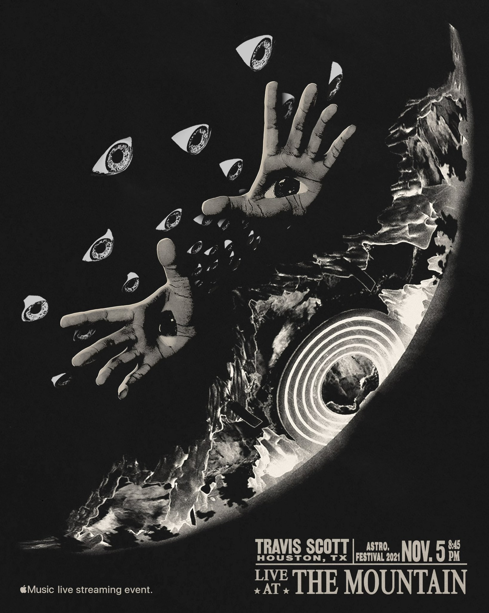
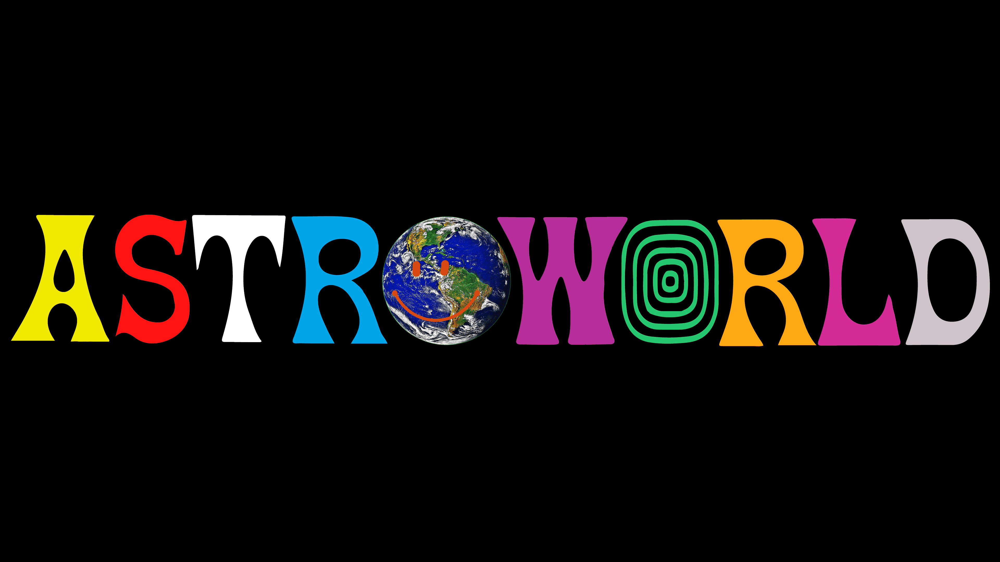

Jacques Berman Webster II, also known as '*TRAVIS SCOTT*' is an American rapper. Scott signed his first major-label contract with Epic Records, and shortly after signed a publishing deal with Kanye's label 'GOOD Music'. In 2018, his third studio album, **Astroworld** was released and produced his first Billboard Hot 100. His career gained notoriety as safety within his concerts became questionable.

Let's start with the top then work our way down. To start with, the 'C' has a very large aperture and has a non-existing beak at the tips of each area. The weight of the character seems light, in actual fact it seems to be light throughout the whole lettering with only minor instances of a 'heavier' weight. Moving onto the 'A' of the logo, it appears to be missing a foot on the right side of the stroke, but once again there are no signs of serifs nor any sings of swashes. Moving onto the 'JACK' part of the logo, the arc (curved part of a letterform leading into a straight stem) seems to not lead to a point and is more rounded, the arms (strokes on either end of the t) are again inconsistent and the left seems to be slightly heavier than that of the one on the right. The 'A' is so deformed that it seems to lack a counter (the inside gap in the middle of a letter usually 'P, A, B'). The letter 'K' in Jack also seems to have two contrasting legs one being rounded and the other leading to a point.

From what we can observe on the bottom right, 'TRAVIS SCOTT' is written in a roman-style (standard type of style or regular weight of an upright typeface), although it does not contain any lowercase letters. The cap height and the baseline for the letters are consistent throughout the writing. However, directly underneath this 'HOUSTON, TX' has a far smaller font size, the font used is similar to the 'TRAVIS SCOTT' but from what I can observe is that the kerning (space in between two letters) is used much more than the lettering mentioned before. What is used for 'TRAVIS SCOTT' is also used for the date to further highlight what is the most important piece of information they want to show their crowd. Contrastingly, the words underneath the line that separates both texts contains serifs (small strokes at the beginning or end of a main letter), the weight for each letter on 'THE MOUNTAIN' is lighter than that of the one used for 'TRAVIS SCOTT' it appears to have contrasting weight however, much more evident on the 'U' and 'N'.

As you may all now know, one of Travis' recent 'ASTROWORLD' concerts went drastically wrong leaving 8 confirmed deaths and a multitude of fans injured physically and mentally. What was most noticeable of the outcome was the mass speculation that the concert was a 'satanic sacrifice'. Anyways, lets analyse the entirety of the logo. Firstly, it seems that the typeface used for this logo is named 'Glyphic Serifs', this category tends to emulate inscriptions rather than pen-drawn text. The letter 'A' has a unique apex (point at the top of a letterform) rather than narrowing to a tip it seems to actually do the opposite and widen out to give the character a special thickness. This may be a stretch but the counter (inside of the A) resembles that of a teardrop? could this be foreboding the tears spilled during the concert? The beaks of the 'S' converge into a point, proliferating the beaks however "thins" out the letter. Lets skip past a few letters and head straight to the 'W' what is the most prominent feature about this letter is both vertex points (bottom ends of the W) mirror that of the apex of the 'A', rather than diverging into a point they seem to thicken more than that of the actual body of the letter. Lastly, the only other noticeable thing about the logo is the second 'O' seems to have a been given a hairline (lightest font family weight, thinnest stroke of a letter), and then repeated with a smaller size over and over to give it an almost "target-board" effect.