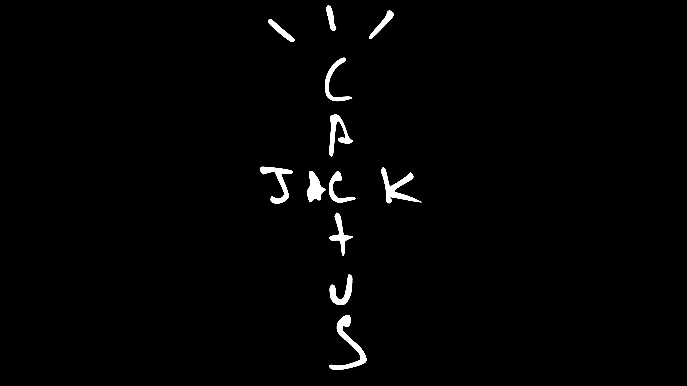

Jacques Berman Webster II, also known as '*TRAVIS SCOTT*' is an American rapper. Scott signed his first major-label contract with Epic Records, and shortly after signed a publishing deal with Kanye's label 'GOOD Music'. In 2018, his third studio album, **Astroworld** was released and produced his first Billboard Hot 100. His career gained notoriety as safety within his concerts became questionable.

Let's start with the top then work our way down. To start with, the 'C' has a very large aperture and has a non-existing beak at the tips of each area. The weight of the character seems light, in actual fact it seems to be light throughout the whole lettering with only minor instances of a 'heavier' weight. Moving onto the 'A' of the logo, it appears to be missing a foot on the right side of the stroke, but once again there are no signs of serifs nor any sings of swashes.