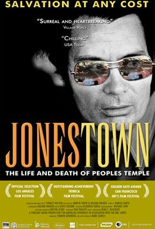
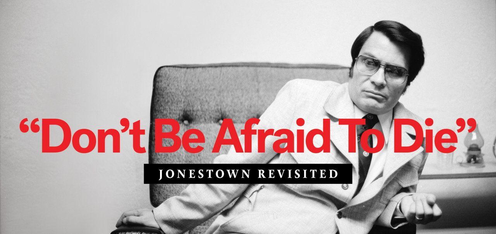
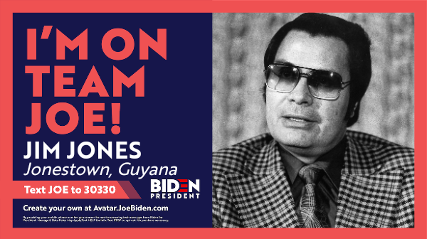

**James Warren Jones** (A.K.A Jim Jones) was an American cult leader, preacher and faith healer who led the *Peoples Temple,* a newly formed organization concealed as a religious group which lasted between 1955-1978. Notoriously known for his orchestrated 'inner-circle' mass murder-suicide at Jonestown.

From observation, there are no signs of embellishment's in the fully capitalised title 'CULT CITY', the "serifless" yet massive title could possible portray the true character of Jim Jones, one that is a big and prominent figure (hence the large font-size) but has no true love for his city (thus the serifs that could possibly show beauty or enhance the life of 'CULT CITY' aren't used). The font used for the title radiates an 80's style of retro, neon lights that scream the city.

Initially, the most obvious feature about this typographic is the split-coloured title, the orange (JONES) to yellow (TOWN) could be alluding to the "darker" operations concealed in a visage of a friendly town. The weight of the title also stays consistent with only minor changes (less weight) on the downstrokes of 'N' and 'W', similarly to previous articles it conveys conformity, uniformity and overall totalitarian power.

First and foremost, the contrast of a black and white background of Jim Jones and the pure red and heavy weighted title just embodies the sheer power and sense of persuasion this evil man has. Us as a reader would maybe giggle, or think nothing of the quote 'Don't Be Afraid To Die' yet for the people of Jonestown and the believers of the People's Temple, this was their purpose. The baseline (bottom of letter) doesnt change along with the cap height being maintained, this further reitterates the never-changing nature of Jones' evil.

Some dark-hearted individuals chose a more sinister alternative to review the situation, specifically 'memeifying' the acts of Jim Jones. Here, we can observe that the person who created the meme poster made the actual visual of Jim Jones' election professionally, a large typeface with again no serifs is used. This presents a clean and formal image to 'reflect' the calm and approachable figure Jones is.