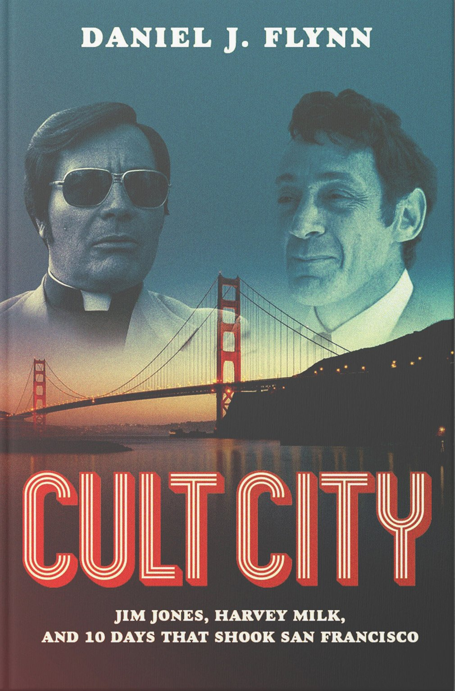

**James Warren Jones** (A.K.A Jim Jones) was an American cult leader, preacher and faith healer who led the *Peoples Temple,* a newly formed organization concealed as a religious group which lasted between 1955-1978. Notoriously known for his orchestrated 'inner-circle' mass murder-suicide at Jonestown.

From observation, there are no signs of embellishment's in the fully capitalised title 'CULT CITY', the "serifless" yet massive title could possible portray the true character of Jim Jones, one that is a big and prominent figure (hence the large font-size) but has no true love for his city (thus the serifs that could possibly show beauty or enhance the life of 'CULT CITY' aren't used).